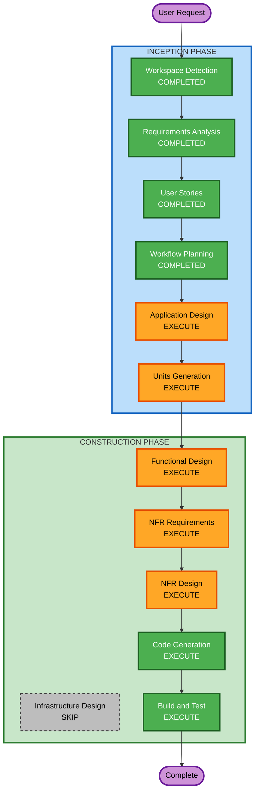

# Execution Plan

## Detailed Analysis Summary

### Project Overview
- **Project Type**: Greenfield (새 프로젝트)
- **Project Name**: 테이블오더 서비스
- **Tech Stack**: FastAPI + React.js + PostgreSQL

### Change Impact Assessment
- **User-facing changes**: Yes - 고객 주문 UI, 관리자 대시보드
- **Structural changes**: Yes - 새로운 시스템 아키텍처 설계 필요
- **Data model changes**: Yes - 새로운 데이터베이스 스키마 설계
- **API changes**: Yes - 새로운 REST API 설계
- **NFR impact**: Yes - 실시간 통신(SSE), 인증, 다중 매장 지원

### Risk Assessment
- **Risk Level**: Medium
- **Rollback Complexity**: Easy (새 프로젝트)
- **Testing Complexity**: Moderate (실시간 통신, 다중 사용자 유형)

---

## Workflow Visualization

---

## Phases to Execute

### INCEPTION PHASE
- [x] Workspace Detection - COMPLETED
- [x] Reverse Engineering - SKIPPED (Greenfield)
- [x] Requirements Analysis - COMPLETED
- [x] User Stories - COMPLETED
- [x] Workflow Planning - COMPLETED
- [ ] Application Design - EXECUTE
  - **Rationale**: 새 프로젝트로 컴포넌트 구조, 서비스 레이어, API 설계 필요
- [ ] Units Generation - EXECUTE
  - **Rationale**: 백엔드/프론트엔드 분리 개발을 위한 작업 단위 분해 필요

### CONSTRUCTION PHASE
- [ ] Functional Design - EXECUTE (per-unit)
  - **Rationale**: 데이터 모델, 비즈니스 로직 상세 설계 필요
- [ ] NFR Requirements - EXECUTE (per-unit)
  - **Rationale**: 실시간 통신(SSE), 인증(JWT), 성능 요구사항 정의 필요
- [ ] NFR Design - EXECUTE (per-unit)
  - **Rationale**: NFR 패턴 적용 설계 필요
- [ ] Infrastructure Design - SKIP
  - **Rationale**: 로컬/온프레미스 배포로 클라우드 인프라 설계 불필요
- [ ] Code Generation - EXECUTE (per-unit)
  - **Rationale**: 실제 코드 구현 필요
- [ ] Build and Test - EXECUTE
  - **Rationale**: 빌드 및 단위 테스트 실행 필요

### OPERATIONS PHASE
- [ ] Operations - PLACEHOLDER
  - **Rationale**: 향후 배포/모니터링 워크플로우

---

## Units Overview (예상)

| Unit | 설명 | 주요 기술 |
|------|------|----------|
| Unit 1: Backend API | FastAPI 백엔드 서버 | FastAPI, PostgreSQL, SQLAlchemy |
| Unit 2: Customer Frontend | 고객용 React 앱 | React.js, Axios |
| Unit 3: Admin Frontend | 관리자용 React 앱 | React.js, Axios, SSE |

---

## Success Criteria
- **Primary Goal**: 테이블오더 MVP 완성
- **Key Deliverables**:
  - FastAPI 백엔드 (인증, 메뉴, 주문, 테이블 관리 API)
  - 고객용 React 앱 (메뉴 조회, 장바구니, 주문)
  - 관리자용 React 앱 (실시간 모니터링, 관리 기능)
  - PostgreSQL 데이터베이스 스키마
  - 단위 테스트
- **Quality Gates**:
  - 모든 API 엔드포인트 동작 확인
  - SSE 실시간 통신 동작 확인
  - 단위 테스트 통과
